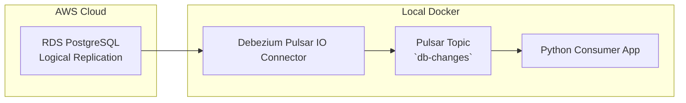

Perfect — here's the **complete GitHub repository setup**, including:

* Project structure
* Docker Compose
* Connector YAML
* SQL init
* Python consumer
* Bash scripts
* `.gitignore`
* README
* Optional `Makefile`
* Sample CDC output
* Architecture diagram (text-based for now)

---

## 📁 `cdc-rds-pulsar/` GitHub Repository Structure

```
cdc-rds-pulsar/
├── connectors/
│   └── debezium-postgres-3.2.0.nar  # (downloaded)
├── db/
│   └── init.sql
├── deploy/
│   └── debezium-postgres-source.yaml
├── .gitignore
├── docker-compose.yml
├── get_connector.sh
├── consume.py
├── Makefile
├── sample_output.json
└── README.md
```

---

## 🐳 `docker-compose.yml`

```yaml
version: '3.7'
services:
  pulsar:
    image: apachepulsar/pulsar:3.2.0
    command: bin/pulsar standalone
    ports:
      - "6650:6650"
      - "8080:8080"
    volumes:
      - ./connectors:/pulsar/connectors
```

---

## 🔌 `deploy/debezium-postgres-source.yaml`

```yaml
tenant: public
namespace: default
name: postgres-cdc
archive: connectors/debezium-postgres-3.2.0.nar
topicName: persistent://public/default/db-changes
parallelism: 1
configs:
  database.hostname: your-db.rds.amazonaws.com
  database.port: "5432"
  database.user: cdc_user
  database.password: cdc_pass
  database.dbname: postgres
  database.server.name: rds-pg
  database.include.schema.changes: "true"
  plugin.name: pgoutput
  slot.name: cdc_slot
  snapshot.mode: initial
```

---

## 🧪 `db/init.sql`

```sql
CREATE TABLE users (
  id SERIAL PRIMARY KEY,
  name TEXT,
  email TEXT
);

INSERT INTO users (name, email) VALUES
  ('Alice', 'alice@example.com'),
  ('Bob', 'bob@example.com');

CREATE ROLE cdc_user WITH REPLICATION LOGIN PASSWORD 'cdc_pass';
GRANT SELECT ON ALL TABLES IN SCHEMA public TO cdc_user;
```

---

## 🐍 `consume.py`

```python
from pulsar import Client

client = Client('pulsar://localhost:6650')
consumer = client.subscribe('db-changes', subscription_name='demo-sub')

print("Listening for CDC events...")
while True:
    msg = consumer.receive()
    try:
        print(f"Received message: {msg.data().decode('utf-8')}")
        consumer.acknowledge(msg)
    except Exception as e:
        print("Error:", e)
        consumer.negative_acknowledge(msg)

client.close()
```

---

## 🔽 `get_connector.sh`

```bash
#!/bin/bash
mkdir -p connectors
cd connectors
wget https://archive.apache.org/dist/pulsar/pulsar-io/debezium/debezium-postgres-3.2.0.nar
```

---

## 📄 `.gitignore`

```gitignore
__pycache__/
connectors/*.nar
.env
```

---

## 🧰 `Makefile` (optional automation)

```makefile
.PHONY: setup run deploy consume

setup:
	bash get_connector.sh

run:
	docker-compose up -d

deploy:
	bin/pulsar-admin sources create --source-config-file deploy/debezium-postgres-source.yaml

consume:
	python consume.py
```

---

## 📦 `sample_output.json`

```json
{
  "before": null,
  "after": {
    "id": 3,
    "name": "Charlie",
    "email": "charlie@example.com"
  },
  "op": "c",
  "ts_ms": 1720000000000
}
```

---

## 📘 `README.md`

````markdown
# CDC from AWS RDS PostgreSQL to Apache Pulsar

This project sets up a mock CDC pipeline using:

- AWS RDS PostgreSQL (with logical replication)
- Apache Pulsar (local, via Docker)
- Debezium Pulsar IO Connector
- Python CDC consumer

## 🚀 Quick Start

### 1. Launch PostgreSQL in RDS

- Use a custom parameter group:
  - `rds.logical_replication = 1`
  - `wal_level = logical`
  - `max_replication_slots = 5`
  - `max_wal_senders = 5`
  - `wal_keep_size = 512`

### 2. Create the schema

Run the script in `db/init.sql` on your RDS instance.

### 3. Start Pulsar

```bash
make run
````

### 4. Download the Debezium Connector

```bash
make setup
```

### 5. Deploy the CDC connector

```bash
make deploy
```

### 6. Run the Python consumer

```bash
make consume
```

### 7. Trigger Changes

```sql
INSERT INTO users (name, email) VALUES ('Charlie', 'charlie@example.com');
UPDATE users SET name = 'Bobby' WHERE name = 'Bob';
DELETE FROM users WHERE name = 'Alice';
```

### ✅ You’ll see CDC messages printed to the terminal.

---

## 🧱 Architecture (Text Diagram)



```
+----------------+      Logical Replication      +---------------------+
| AWS RDS (PGSQL)| ----------------------------->| Pulsar IO Connector |
|    users table |                               |  (Debezium Source)  |
+----------------+                               +---------------------+
                                                          |
                                                          v
                                             +-------------------------+
                                             | Pulsar Topic: db-changes|
                                             +-------------------------+
                                                          |
                                                          v
                                             +-------------------------+
                                             |   Python Consumer App   |
                                             +-------------------------+
```

```

---

Let me know if you'd like this zipped, exported to a GitHub repo, or packaged as a downloadable starter project.
```
